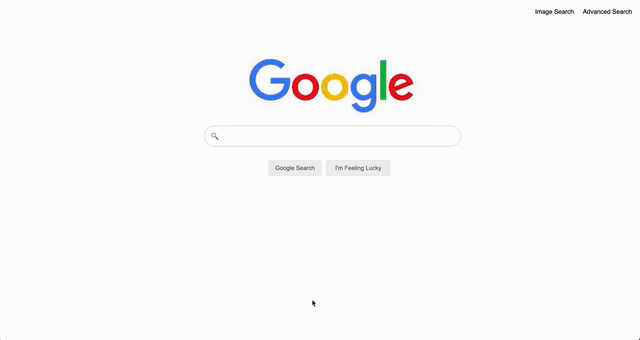

# Search

Front-end of Google designed using HTML and CSS. On the Google Search page, when a query is made, the user is navigated to the proper results page. If the user searches using the 'I'm Feeling Lucky' button, the user is redirected straight to the first search result. The Google Search page displays hyperlinks in the right corner that navigate to front-end pages similar to Google Images or Advanced Search. On the advanced page, queries can be made using specific search requests.

# Demo

